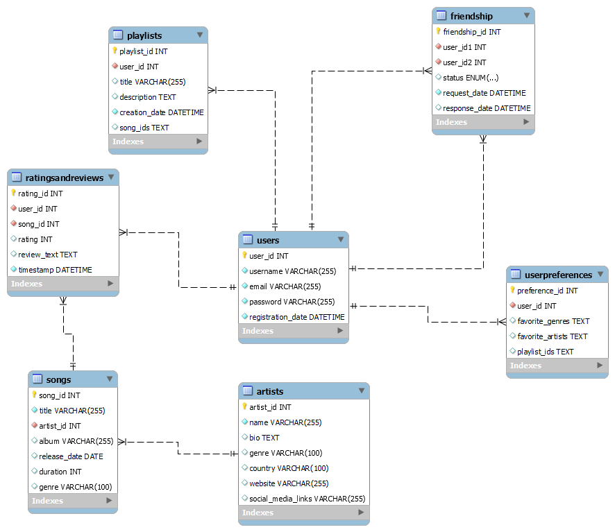

# CSIS228Project

The Music Discovery and Recommendation Service is a web application that allows music enthusiasts to discover new music, create personalized playlists, and connect with a community. It features a vast library of songs, an intelligent recommendation system, and interactive discussions. This backend is built using Node.js, Express and other technologies to provide the necessary server and API functionality.

## FEATURES:

-   Create a RESTFUL API for a music discovery web application.

## TABLE OF CONTENTS:

-   [Getting Started](#getting-started)
-   [Dependencies](#dependencies)
-   [Database](#database)

## GETTING STARTED:

-   Navigate to your project path:
    `npm install`
-   Clone the repository from:
    ````bash
     git clone https://github.com/MhmdDaoud/CSIS228Project.git```
    ````
-   Run the application
    `npm run dev`

## DEPENDENCIES:

-   `nodemon: ^3.0.1`
-   `body-parser: ^1.20.2`
-   `cors: ^2.8.5` -`dotenv: ^16.3.1` -`express: ^4.18.2` -`jsonwebtoken": ^9.0.2` -`express-validator: ^7.0.1` -`moment: ^2.29.4` -`mysql2: ^3.6.2`

## DATABASE:


